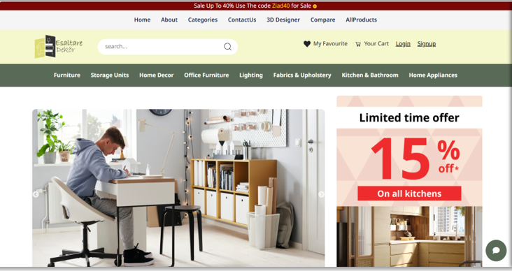
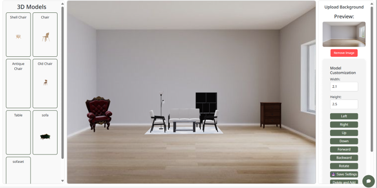
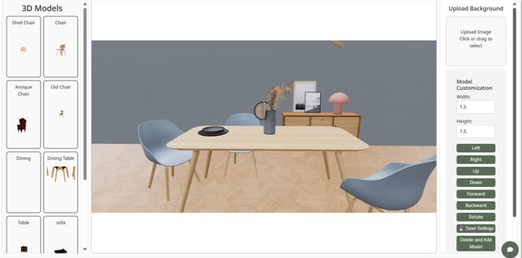

# 🛋️ Esaltare Dekör — Home Decor E-Commerce Platform  
A modern full-stack e-commerce platform specializing in home decor, providing a seamless shopping experience for customers, powerful tools for vendors, and a complete admin management dashboard.  
The platform also integrates AI features such as a smart chatbot and personalized recommendations.

---

## 📸 Project Preview  
Below are some screenshots from the project (stored in the `assets` folder):

  
 

---

## 📖 Project Description  
Esaltare Dekör is an innovative platform designed to improve the way users buy furniture and décor online.  
It offers:

- User-friendly browsing and filtering  
- High-quality product previews  
- Compare products  
- Add to Favorites & Cart  
- Real-time order tracking  
- AI-powered design suggestions  
- Built-in chatbot for support  
- Vendor subscription system  
- Admin management dashboard  
- 3D visualization for room decorating

---

## 🎯 Project Goals  
- Deliver an engaging and seamless shopping experience  
- Provide powerful vendor management tools  
- Enable admins to control the platform efficiently  
- Offer personalized product recommendations  
- Support secure payments and fast order tracking  
- Allow users to visualize décor items in 3D  
- Build a scalable and modern e-commerce infrastructure  

---

## 🛠️ Technologies Used  
### **Frontend**
- React.js  
- HTML/CSS/JavaScript  
- Axios  
- Tailwind / Custom UI Components  

### **Backend**
- Node.js (depending on final implementation)  
- RESTful APIs  
- MySQL Database  

### **AI**
- Chatbot (LLM-based)  
- Recommendation System  
- Personality-based product suggestions  

### **Tools**
- Git & GitHub  
- VS Code  
- Postman  
- Figma (for UI/UX)  

---

## 🚀 Main Features  
### 👤 User Features  
- Browse furniture categories  
- Product comparison  
- Add to favorites  
- Add to cart  
- Checkout & secure payment  
- Track order location  
- View similar products  
- AI chatbot support  

### 🛒 Vendor Features  
- Vendor profile  
- Add/edit/delete products  
- Subscription packages  
- Performance insights  
- Product submission system (with admin approval)  

### 🔐 Admin Features  
- Full dashboard  
- Manage users & vendors  
- Manage categories, brands, and products  
- View and process orders  
- Handle coupons  
- Post announcements  
- Review management  
- Full analytics  

---

## 🧠 AI Features  
- Personalized recommendations  
- Chatbot for assistance  
- 3D room visualization help  
- User preference analysis  